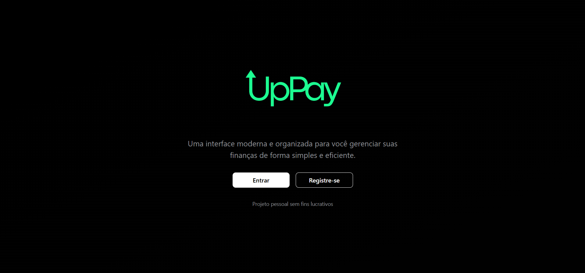
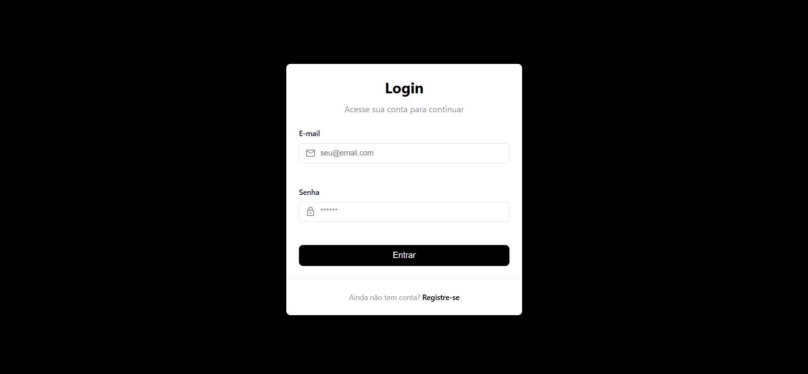
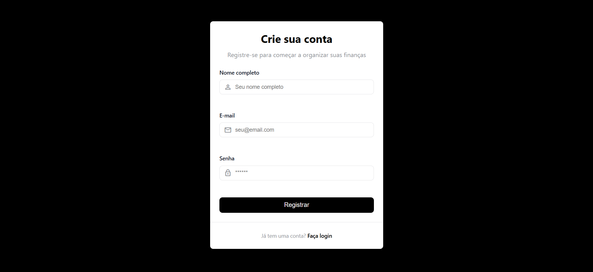
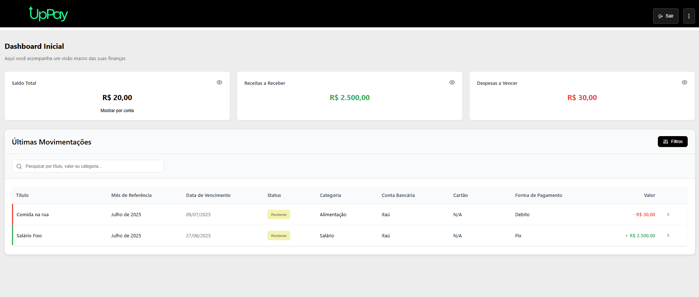
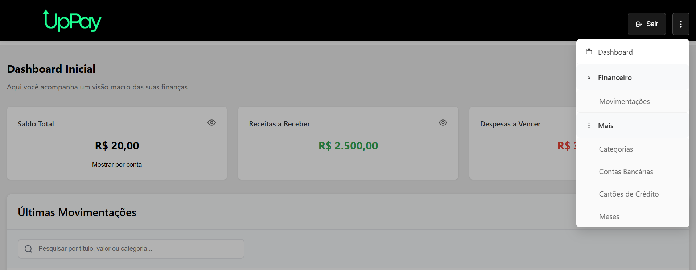
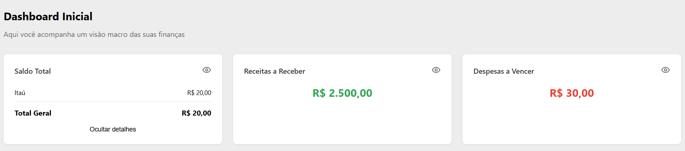
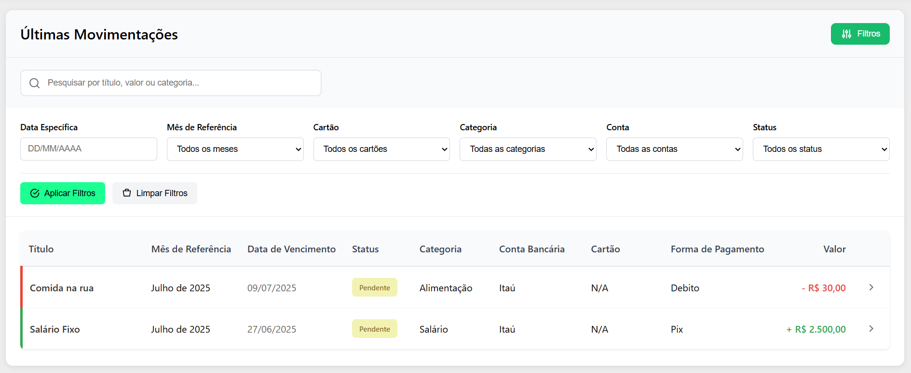
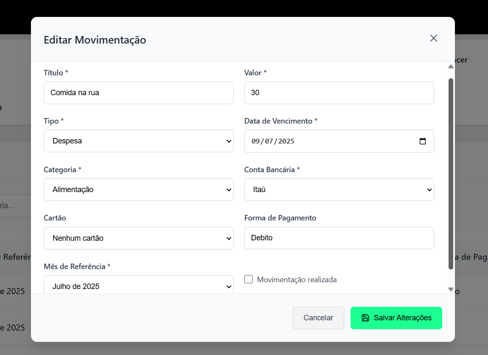
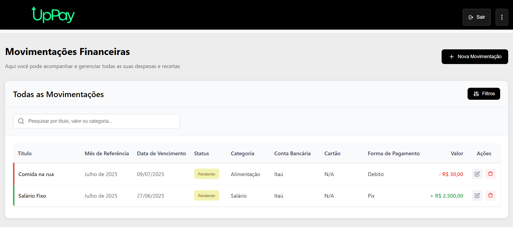
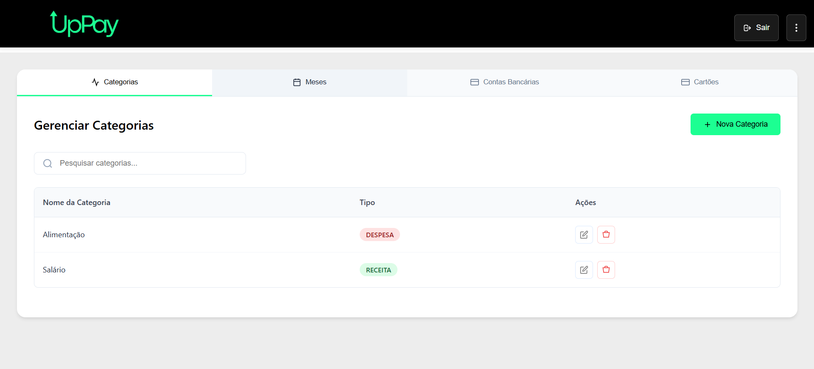

# UpPAY

Sistema completo para controle financeiro pessoal, com API em .NET 8 e front-end moderno.



## Sumário

- [UpPAY](#uppay)
  - [Sumário](#sumário)
  - [Sobre o Projeto](#sobre-o-projeto)
  - [Funcionalidades](#funcionalidades)
  - [Arquitetura](#arquitetura)
  - [Tecnologias Utilizadas](#tecnologias-utilizadas)
  - [Pré-requisitos](#pré-requisitos)
  - [Configuração do Ambiente](#configuração-do-ambiente)
    - [1. Clone o repositório](#1-clone-o-repositório)
    - [2. Back-end (API)](#2-back-end-api)
    - [3. Front-end](#3-front-end)
  - [Execução](#execução)
  - [Principais Endpoints](#principais-endpoints)
  - [Utilização](#utilização)
    - [Login](#login)
    - [Registro](#registro)
    - [Primeiro contato com o sistema](#primeiro-contato-com-o-sistema)
    - [Movimentações](#movimentações)
    - [Gerenciamento](#gerenciamento)
  - [Contribuição](#contribuição)
  - [Licença](#licença)

---

## Sobre o Projeto

O **UpPAY** é uma aplicação web para gerenciamento financeiro pessoal, permitindo o controle de receitas, despesas, categorias e contas, além do acompanhamento de saldos e movimentações. O sistema foi desenvolvido com foco em segurança, escalabilidade e facilidade de uso.

---

## Funcionalidades

- Cadastro e autenticação de usuários
- Controle de receitas e despesas
- Visualização de saldos por conta
- Dashboard com indicadores financeiros
- Filtros e pesquisa de movimentações
- Gerenciamento de categorias, contas, cartões e meses
- Interface responsiva e intuitiva

---

## Arquitetura

- **Back-end**:  
  - .NET 8  
  - Clean Architecture (Domain, Application, Infrastructure, API)  
  - RESTful API  
  - Swagger/OpenAPI  
  - Autenticação JWT  
  - SQL Server

- **Front-end**:  
  - HTML, CSS, JavaScript  
  - Consumo de endpoints REST  
  - Gerenciamento de autenticação (JWT)  
  - Responsividade

---

## Tecnologias Utilizadas

- .NET 8 (API)
- SQL Server
- HTML, CSS, JavaScript (Front-end)
- JWT para autenticação
- Swagger para documentação da API

---

## Pré-requisitos

- [.NET 8 SDK](https://dotnet.microsoft.com/download)
- [SQL Server](https://www.microsoft.com/pt-br/sql-server/sql-server-downloads)
- Editor de código ([Visual Studio 2022](https://visualstudio.microsoft.com/pt-br/) recomendado para API, [VS Code](https://code.visualstudio.com/) para front-end)

---

## Configuração do Ambiente

### 1. Clone o repositório

```sh
git clone https://github.com/Victorpcheco/uppay-controle-financeiro-web.git
cd uppay-controle-financeiro-web
```

### 2. Back-end (API)

```sh
cd api/src
dotnet restore
```

- Configure a string de conexão no arquivo `appsettings.json` em `api/src/ControleFinanceiro.API/`.

- Execute as migrations (se necessário):

```sh
dotnet ef database update --project ControleFinanceiro.Infrastructure --startup-project ControleFinanceiro.API
```

- Inicie a API:

```sh
dotnet run --project ControleFinanceiro.API
```

A API estará disponível para uso em `https://localhost:5001` (ou porta configurada).

### 3. Front-end

Para rodar o front-end localmente, entre na pasta `front` pelo seu editor de código.  
Abra o arquivo `index.html` no navegador ou utilize um servidor local (exemplo: extensão Live Server no VS Code).

---

## Execução

- Acesse o Swagger em `https://localhost:5001/swagger` para testar os endpoints da API. (Ou na rota configurada)
- Utilize o front-end para consumir a API e gerenciar suas finanças.

---

## Principais Endpoints

| Método | Rota                                         | Descrição                      | Autenticado |
|--------|----------------------------------------------|-------------------------------|-------------|
| POST   | /api/usuarios/login                              | Login                         | Não         |
| POST   | /api/usuarios/registrar                           | Cadastro                      | Não         |
| GET    | /api/dashboard/saldo-contas                  | Saldos por conta              | Sim         |
| GET    | /api/dashboard/valor-em-aberto-despesas      | Total de despesas em aberto   | Sim         |
| GET    | /api/dashboard/valor-em-aberto-receitas      | Total de receitas em aberto   | Sim         |
| GET    | /api/dashboard/movimentacoes-dashboard       | Movimentações paginadas       | Sim         |
| ...    | ...                                          | ...                           | ...         |

---

## Utilização 

### Login 

Na tela de login caso já tenha cadastrado um usuário poderá inserir o e-mail e senha 



### Registro 

Caso ainda não tenha registrado um usuário poderá criar um, na tela de registro que você pode acessar via tela inicial (index) ou pelo link na tela do login.

Insira o nome do usuário, o e-mail seguindo os padrões de formatação e a senha contendo uma letra maiúscula, pelo menos 6 caracteres e um sendo especial. 



### Primeiro contato com o sistema

Após se autenticar você vai ter o primeiro contato com o sistema visualizando a seguinte tela: 



Na navbar você encontra o botão para realizar o logout, e nos 3 pontinhos o menu de navegação onde consegue ir navegando por outras funcionalidades do sistema como a tela de movimentações, categorias etc. 



Na parte superior da tela você vai se deparar com os três cards principais com o saldo total de todas as contas, o valor de receitas a receber e o valor de despesas a vencer. Podendo ser expandido e visualizar os saldos separadamente por contas cadastradas. 



Na área inferior você consegue visualizar suas últimas movimentações, podendo também expandir a aba de filtros e filtra-lás. 



E ao clicar na seta localizada na última coluna poderá exibir os detalhes de cada movimentação possibilitando realizar alterações.



### Movimentações 

Após o primeiro contato e ao navegar por outras telas no menu superior você irá encontrar a tela de movimentações onde irá visualizar a listagem de todas suas despesas e receitas de forma paginada, nela você tem funções adicionais, a de exclusão e adição de uma nova movimentação o que não é possível na tela de dashboard. 



### Gerenciamento

Você localiza a parte de gerenciamento clicando em qualquer uma das opções no menu vertical dentro da classificação "mais" é onde você poderá criar, editar, visualizar e excluir suas entidades paralelas, como categorias, contas, cartões e meses 



---

## Contribuição

Contribuições são bem-vindas! Para contribuir, siga os passos abaixo:

1. Faça um fork do projeto
2. Crie uma branch (`git checkout -b feature/sua-feature`)
3. Commit suas alterações (`git commit -am 'feat: nova feature'`)
4. Push na branch (`git push origin feature/sua-feature`)
5. Abra um Pull Request

---

## Licença

Este projeto está licenciado sob a [MIT License](LICENSE).

